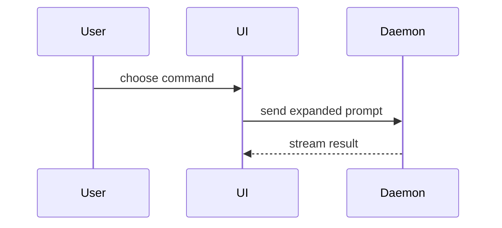

# Ship workflow — idea to merged

**Read this when:** spec, tickets, implement, review, PR, triage, retro, research, hand-built wizards

**Layer:** pocock's process skills; each is a command, not an always-on rule

Loaded on demand: the always-on rules live in the skill's `SKILL.md`. The
bodies below are upstream text carried verbatim, with the per-section
provenance and every declared edit listed in `SOURCES.md` beside this file.

| section | from | load |
|---|---|---|
| [ask-matt — which flow fits this situation](#ask-matt-which-flow-fits-this-situation) | `mattpocock-skills` | command |
| [Caveman commit — the message format](#caveman-commit-the-message-format) | `caveman` | always |
| [To spec — conversation into a published spec](#to-spec-conversation-into-a-published-spec) | `mattpocock-skills` | command |
| [Third-party integration, the additive way](#third-party-integration-the-additive-way) | `mem0` | always |
| [To tickets — tracer-bullet vertical slices with blocking edges](#to-tickets-tracer-bullet-vertical-slices-with-blocking-edges) | `mattpocock-skills` | command |
| [Implement — build the described work, drive tdd, close with review](#implement-build-the-described-work-drive-tdd-close-with-review) | `mattpocock-skills` | command |
| [Implement spec — whole spec on one branch, subagents on the frontier](#implement-spec-whole-spec-on-one-branch-subagents-on-the-frontier) | `mattpocock-skills` | command |
| [Code review — standards axis and spec axis, in parallel](#code-review-standards-axis-and-spec-axis-in-parallel) | `mattpocock-skills` | always |
| [PR — summary, before/after evidence, merge-danger call](#pr-summary-beforeafter-evidence-merge-danger-call) | `mattpocock-skills` | always |
| [Triage — issues and PRs through a role state machine](#triage-issues-and-prs-through-a-role-state-machine) | `mattpocock-skills` | command |
| [Wayfinder — plan more than one session can hold](#wayfinder-plan-more-than-one-session-can-hold) | `mattpocock-skills` | command |
| [Retro — improve the agent's environment, worst first](#retro-improve-the-agents-environment-worst-first) | `mattpocock-skills` | command |
| [Research — primary sources, cited file in the repo](#research-primary-sources-cited-file-in-the-repo) | `mattpocock-skills` | always |
| [Wizard — bash wizard for steps only a human can do](#wizard-bash-wizard-for-steps-only-a-human-can-do) | `mattpocock-skills` | always |

---

## ask-matt — which flow fits this situation

> `mattpocock-skills` / `ask-matt` / the user asks what to do next

You don't remember every skill, so ask.

Before stating what a skill does or recommending a step be skipped, read that skill's SKILL.md: the summaries here are for orientation only.

A **flow** is a path through the skills. Most paths run along one **main flow**, and two **on-ramps** merge onto it. Everything else is standalone, or a vocabulary layer that runs underneath.

### The main flow: idea → ship

The route most work travels. You have an idea and want it built.

1. **`/grill-with-docs`** sharpens the idea by interview. Start here whenever you are **working in a working directory**: it's stateful, retaining what it learns in `GLOSSARY.md` and ADRs. (No working directory? Use `/grill-me` instead, covered under Standalone. Both run the same `/grilling` primitive; `grill-with-docs` is the one that leaves a paper trail, which makes it the better of the two whenever a repo is there to leave it in.)
2. **Branch: can you settle every question in conversation?** If a question needs a runnable answer (state, business logic, a UI you have to see), detour through a prototype, bridged by **`/handoff`** in both directions (a prototype lives in its own directory, which is exactly what `/handoff` is for; see Phase boundaries):
   - **`/handoff`** out, then open a fresh session against that file,
   - **`/prototype`** to answer the question with throwaway code,
   - **`/handoff`** back what you learned, and reference it from the original idea thread.
3. **Branch: is this a multi-session build?**
   - **Yes** → **`/to-spec`** (turn the thread into a spec), then **`/to-tickets`** to split it into tracer-bullet tickets, each declaring its **blocking edges**. Then work the tickets one of two ways:
     - **`/implement`** per ticket, **`/clear`ing context between each one**. On a local tracker that's one file per ticket under `.scratch/<feature>/issues/`, worked blockers-first by hand; on a real tracker the edges become native blocking links, so any ticket whose blockers are done can be grabbed. Each ticket is self-contained, so the last one's context is disposable.
     - **`/implement-spec`** for the whole spec in one run. It reads the tickets as a **task graph**, runs implementer subagents across the ready **frontier** in parallel, and lands everything on one **integration branch**. Reach for it when you'd rather orchestrate the build than drive each ticket yourself.
   - **No** → **`/implement`** right here, in the same context window.

   Either way, the code gets built by driving **`/tdd`** (one red-green slice at a time) and closes out with **`/code-review`**, a two-axis review (Standards + Spec) of the diff. `/implement` runs both per ticket; `/implement-spec`'s implementers each drive `/tdd`, and it runs one `/code-review` over the integration branch. Reach for **`/tdd`** on its own when you just want to build a concrete behaviour test-first without a full spec, and **`/code-review`** on its own whenever you want to review a branch or PR against a fixed point.

   When the work goes up as a pull request, **`/pr`** shapes the body: the smallest visual that shows the change, before/after evidence that it works, and a one-way or two-way door call. It's model-invoked, so the agent reaches for it whenever it writes a PR.

4. **`/retro`** closes the loop. After a build, and especially one that went sideways, it looks back over the session and suggests changes to the agent's **environment**, not the code: navigation pointers, automated checks, the coding standards `/code-review` enforces, steering files, tooling. Mechanical mistakes become deterministic checks; judgement calls become coding standards. The next build then starts from a better environment.

#### Context hygiene

Keep steps 1–3 in **one unbroken context window** (don't compact or clear until after `/to-tickets`) so the grilling, spec, and tickets all build on the same thinking. Each `/implement` then starts fresh, working from the ticket. Run `/retro` in the session it's looking back on, before you clear; after clearing, point it at that session's log instead.

The limit on this is the **[smart zone](https://www.aihero.dev/ai-coding-dictionary/smart-zone)**: the window (~150k tokens on state-of-the-art models) within which the model still reasons sharply. If a session approaches it before `/to-tickets`, don't push on degraded; `/compact` at the nearest phase boundary and carry on (see Phase boundaries).

### On-ramps

A starting situation that generates work, then merges onto the main flow.

- **Bugs and requests piling up** → **`/triage`**. It moves issues through triage roles and produces agent-ready issues, which **`/implement`** later picks up.

  Triage is only for issues **you didn't create**: bug reports, incoming feature requests, anything that arrives raw. Tickets that `/to-tickets` produced are already agent-ready, so **don't triage them**.

- **Something's broken** → **`/diagnosing-bugs`**. For the hard ones: the bug that resists a first glance, the intermittent flake, the regression that crept in between two known-good states. It refuses to theorise until it has a **tight feedback loop** (one command that already goes red on *this* bug), then fixes with a regression test. Once the fix is in, run **`/retro`** in the same session to ask what would have prevented the bug; where the real finding is that there's no good seam to lock it down, that's a job for **`/improve-codebase-architecture`**.

- **A huge, foggy effort: a greenfield project or a huge feature build, too big for one session** → **`/wayfinder`**, the most cognitively demanding flow here. When the way from here to the destination isn't visible yet, it charts a **shared map** of **decision tickets** on the issue tracker and resolves them one at a time, producing **decisions, not deliverables**, until the fog is pushed back and the way is clear. Where **`/grill-with-docs`** sharpens an idea you can hold in one session, wayfinder is for the idea you can't, and it's slower and denser, so save it for exactly that, never a well-scoped feature.

  When the map clears, **it hands off, it doesn't build**: merge onto the main flow at **`/to-spec`**, which collapses the map's linked decisions into a buildable plan, then `/to-tickets` and `/implement` as usual. Looping the map straight into `/implement` skips that collapse and throws the linked detail away, so go straight to `/implement` only when the effort turned out genuinely small.

### Codebase health

Not feature work, just upkeep.

- **`/improve-codebase-architecture`** runs whenever you have a spare moment to keep the codebase good for agents to operate in. It surfaces **deepening opportunities**; picking one _generates an idea_ you can take into the main flow at `/grill-with-docs`. It's the survey that finds the candidates; **`/codebase-design`** (below) is the bench you design the chosen one on.

### Vocabulary underneath

Two model-invoked references that run *beneath* the other skills, each the single source of truth for its vocabulary. Reach for them directly when the **words**, not the process, are the problem; or let the skills above pull them in.

- **`/domain-modeling`**: sharpen the project's *domain* language: challenge a fuzzy term, resolve an overloaded word ("account" doing three jobs), record a hard-to-reverse decision as an ADR. It's the active discipline `/grill-with-docs` drives to keep `GLOSSARY.md` a clean glossary.
- **`/codebase-design`** is the deep-module vocabulary (module, interface, depth, seam, adapter, leverage, locality) for designing a module's *shape*: a lot of behaviour behind a small interface at a clean seam. `/tdd` and `/improve-codebase-architecture` both speak it.

### Phase boundaries

A **phase** is a chunk of work inside a session: the grilling, the implementation, the QA. At the **boundary** between two of them you have five options, and picking between them is the fuzziest decision in this whole map:

- **Continue**: stay put. Costs nothing, loses nothing.
- **`/clear`**: empty the window, when nothing here matters to what's next.
- **`/handoff`** writes a portable markdown file. Narrow: only for a **new harness**, a **new directory**, a **colleague**, or forking a side task **mid-phase**. What it buys is portability.
- **Subagent**: send a tightly-scoped task to its own window and get a report back.
- **`/compact`** compresses this context and seeds a fresh session with it. The **default**, at the bottom of the tree rather than the first reach.

Read [PHASE-BOUNDARIES.md](#phase-boundaries-ask-matt) for the ordered tree: the five questions, the reasoning behind each branch, and why the primary-source cost makes **Continue** the one to rule out first. Make the decision **at** a boundary; mid-phase, continue or split the rest into subagents.

### Standalone

Off the main flow entirely.

- **`/grill-me`**: the same relentless interview as `/grill-with-docs`, but **stateless**: it saves nothing locally and builds no `GLOSSARY.md`. Reach for it when you are **not working in a working directory** (sharpening a plan, a design, a piece of writing, anything with no repo under it). If you are in a working directory, use `/grill-with-docs` instead: it runs the same interview and leaves a paper trail, so it is strictly the better one.
- **`/grilling`** is the interview primitive itself: rounds, the frontier, facts are the agent's job and decisions are yours. `/grill-me` and `/grill-with-docs` are the two named ways in, and `/triage`, `/wayfinder` and `/improve-codebase-architecture` all run it internally. Reach for it directly only when you want the interview with no wrapper around it.
- **`/prototype`** is a small, throwaway program that answers one design question: does this state model feel right, or what should this UI look like. Throwaway is a constraint on how the code is written, not a promise to destroy it: the answer folds into the real code, and the prototype itself is kept as a **primary source** on a `prototype/<name>` branch out of main, pointed at from the implementation issue. It's the detour in step 2 of the main flow, but reach for it any time a design question is hard to settle on paper.
- **`/research`**: delegate reading legwork to a **background agent**: it investigates a question against **primary sources**, then leaves a cited Markdown file in the repo. Keep working while it reads. The file it produces is something to take *into* the main flow at `/grill-with-docs`, since research feeds the thinking rather than replacing it.
- **`/to-questionnaire`** comes in when the thing blocking you isn't in your head or the codebase but in **someone else's**, and it writes them a questionnaire to fill in. It's the inverse of `/grill-me`: instead of interviewing you about the subject, it interviews you about the **send** (who it's going to, what you need back) and aims the questions at the gap. What comes back is material for `/grill-with-docs` or `/to-spec`.
- **`/wizard`** is for the steps only a **human** can take: provisioning infrastructure, setting up credentials or CI secrets, clicking through an unfamiliar third-party dashboard, running a one-off migration or cutover. It generates an interactive bash script that opens each URL, captures each value, and writes it into `.env` and GitHub secrets, so the procedure stops being something you re-explain to an agent every time. Model-invoked, so the agent reaches for it the moment it hits a wall only you can pass. If the agent could just do it itself, it should; this is for where a human is genuinely in the loop.
- **`/wait-what`** is the corrective for a message that didn't land. Use it mid-conversation, inside any other skill, and the agent re-pitches what it just said with the context you were missing, in plain English, using the `GLOSSARY.md` vocabulary. It works after the fact; `/grill-with-docs` is the upfront cure, because a shared language agreed early is what stops the jargon arriving at all.
- **`/teach`**: learn a concept over multiple sessions, using the current directory as a stateful workspace.
- **`/writing-for-agents`** is the reference for writing documents agents consume: skills, AGENTS.md, pointed-at docs.

### Precondition

**`/setup-matt-pocock-skills`**: run before your first engineering flow to configure the issue tracker, triage labels, and doc layout the other skills assume. Custom issue trackers also work.

### Phase boundaries (ask-matt)

> carried verbatim from `upstream/mattpocock-skills/engineering/ask-matt/PHASE-BOUNDARIES.md`, the same upstream directory as `ask-matt`.

A **phase** is a chunk of work inside a session: the grilling, the implementation, the QA. The definition is fuzzy on purpose: a phase ends when you think *"ok, we're done with that"*.

The **phase boundary** is the gap between two phases, and it is the only place this decision belongs. Mid-phase there is no decision to make: continue, or split the work that's left into subagents. Compacting mid-phase makes the agent lose the thread.

### The five options

| Option       | What it does                                                    |
| ------------ | --------------------------------------------------------------- |
| **Continue** | Stay in the session. No context switch at all.                    |
| **`/clear`** | Empty the context window and start from nothing.                  |
| **`/handoff`** | Write a portable markdown file and seed a session anywhere with it. |
| **Subagent** | Send the task to its own context window and get a report back.     |
| **`/compact`** | Compress this context and seed a fresh session with the summary.  |

### The tree

Work top to bottom at the boundary. The first **yes** wins.

**1. Can you continue in this session?** Two things make the answer yes: the next phase needs this phase as a **primary source**, or you have enough [smart zone](https://www.aihero.dev/ai-coding-dictionary/smart-zone) left (~150k tokens) for the next phase to fit. Grilling → implementation is the standard yes: the implementation wants the reasoning verbatim, not a summary of it. Continue costs nothing and loses nothing, so rule it out before anything else.

**2. Is the context irrelevant to what comes next?** Is everything in this session (the exploration, the decisions, the dead ends) disposable? If so, **`/clear`**. It is the cheapest move on the board: it takes no time and hands back the whole window. `/clear` also isn't terminal: the old session stays resumable.

The cost of getting this wrong is one-way. Clear a *relevant* context and you lose the **why** behind what you built, and no amount of reading the diff back gets it returned.

**3. Do you need to hand off?** `/handoff` is narrow. You need it only when you are:

- swapping to a **new harness** (Claude → Codex),
- moving to a **new directory** or repo,
- sending the work to a **colleague**,
- or forking a side task you found **mid-phase** without derailing what you're doing.

That list is the whole clause. What `/handoff` buys is **portability**: a file that travels. If nothing is travelling, you don't need it.

**4. Can the task be done AFK?** Is it scoped tightly enough to run with you away from the keyboard, no steering? Then send it to a **subagent** and leave this session untouched. Automated review is the standard case: the agent reads the diff and reports, and you aren't needed while it does.

**5. Otherwise, `/compact`.** Relevant context, same harness, same directory, and you need to stay in the loop: this is where the tree lands, and it lands here often. Pass it an instruction (`/compact we're going to QA this area`) so the summary keeps what the next phase needs.

`/compact` is the **default, not the first reach**. It sits at the bottom because the four questions above it are all cheaper or more precise. The failure mode when people start here is a fresh session that is confidently wrong about a decision the summary flattened.

### Primary and secondary sources

Every move except **Continue** turns a **primary source** into a **secondary source**: the session as it happened, replaced by a summary of it. The trade is always the same shape:

| Source                            | Information | Noise | Room to move |
| --------------------------------- | ----------- | ----- | ------------ |
| Primary (Continue)                | Full        | Lots  | Little       |
| Secondary (`/compact`, `/handoff`) | Lossy       | Less  | Lots         |

This is why question 1 comes first. You only pay the lossiness when staying costs more than it saves.

### These are judgement calls

The questions are not objective: each has taste in it, and the same boundary can go two ways on two days. The value is in asking them **in order**, at the boundary rather than in the middle of the work.

## Caveman commit — the message format

> `caveman` / `caveman-commit` / writing a commit message, a PR title, or changelog lines

Write commit messages terse and exact. Conventional Commits format. No fluff. Why over what.

### Rules

**Subject line:**
- `<type>(<scope>): <imperative summary>` — `<scope>` optional
- Types: `feat`, `fix`, `refactor`, `perf`, `docs`, `test`, `chore`, `build`, `ci`, `style`, `revert`
- Imperative mood: "add", "fix", "remove" — not "added", "adds", "adding"
- ≤50 chars when possible, hard cap 72
- No trailing period
- Match project convention for capitalization after the colon

**Body (only if needed):**
- Skip entirely when subject is self-explanatory
- Add body only for: non-obvious *why*, breaking changes, migration notes, linked issues
- Wrap at 72 chars
- Bullets `-` not `*`
- Reference issues/PRs at end: `Closes #42`, `Refs #17`

**What NEVER goes in:**
- "This commit does X", "I", "we", "now", "currently" — the diff says what
- "As requested by..." — use Co-authored-by trailer
- "Generated with Claude Code" or any AI attribution — unless the user's own rule requires an `Assisted-by`/AI-attribution trailer, then add it as a trailer
- Emoji (unless project convention requires)
- Restating the file name when scope already says it

### Examples

Diff: new endpoint for user profile with body explaining the why
- ❌ "feat: add a new endpoint to get user profile information from the database"
- ✅
  ```
  feat(api): add GET /users/:id/profile

  Mobile client needs profile data without the full user payload
  to reduce LTE bandwidth on cold-launch screens.

  Closes #128
  ```

Diff: breaking API change
- ✅
  ```
  feat(api)!: rename /v1/orders to /v1/checkout

  BREAKING CHANGE: clients on /v1/orders must migrate to /v1/checkout
  before 2026-06-01. Old route returns 410 after that date.
  ```

### Auto-Clarity

Always include body for: breaking changes, security fixes, data migrations, anything reverting a prior commit. Never compress these into subject-only — future debuggers need the context.

### Boundaries

Only generates the commit message. Does not run `git commit`, does not stage files, does not amend. Output the message as a code block ready to paste. "stop caveman-commit" or "normal mode": revert to verbose commit style.

## To spec — conversation into a published spec

> `mattpocock-skills` / `to-spec` / the discussion is finished and needs writing down

This skill takes the current conversation context and codebase understanding and produces a spec. Do NOT interview the user; just synthesize what you already know.

The issue tracker and triage label vocabulary should have been provided to you. If not, tell the user to run `/setup-matt-pocock-skills`.

### Process

1. Explore the repo to understand the current state of the codebase, if you haven't already. Use the project's domain glossary vocabulary throughout the spec, and respect any ADRs in the area you're touching.

2. Sketch out the seams at which you're going to test the feature. Existing seams should be preferred to new ones. Use the highest seam possible. If new seams are needed, propose them at the highest point you can. The fewer seams across the codebase, the better - the ideal number is one.

Check with the user that these seams match their expectations.

3. Write the spec using the template below, then publish it to the project issue tracker. Apply the `ready-for-agent` triage label - no need for additional triage.

<spec-template>

### Problem Statement

The problem that the user is facing, from the user's perspective.

### Solution

The solution to the problem, from the user's perspective.

### User Stories

A LONG, numbered list of user stories. Each user story should be in the format of:

1. As an <actor>, I want a <feature>, so that <benefit>

<user-story-example>
1. As a mobile bank customer, I want to see balance on my accounts, so that I can make better informed decisions about my spending
</user-story-example>

This list of user stories should be extremely extensive and cover all aspects of the feature.

### Implementation Decisions

A list of implementation decisions that were made. This can include:

- The modules that will be built/modified
- The interfaces of those modules that will be modified
- Technical clarifications from the developer
- Architectural decisions
- Schema changes
- API contracts
- Specific interactions

Do NOT include specific file paths or code snippets. They may end up being outdated very quickly.

Exception: if a prototype produced a snippet that encodes a decision more precisely than prose can (state machine, reducer, schema, type shape), inline it within the relevant decision and note briefly that it came from a prototype. Trim to the decision-rich parts, not a working demo, just the important bits.

### Testing Decisions

A list of testing decisions that were made. Include:

- A description of what makes a good test (only test external behavior, not implementation details)
- Which modules will be tested
- Prior art for the tests (i.e. similar types of tests in the codebase)

### Out of Scope

A description of the things that are out of scope for this spec.

### Further Notes

Any further notes about the feature.

</spec-template>

## Third-party integration, the additive way

> `mem0` / `mem0-integration-principles` / adding a library, service or memory layer to someone else's working codebase

> **Merge note.** This is the only part of mem0's skill set that is a rule rather than an SDK walkthrough, so it is the only part carried: keep one H2 section verbatim and drop the rest by name. Everything the dropped sections ask for (`npm view`, fetching docs at runtime, delegating to published skills) is not implementable here and would have been invented if kept.

> *(not carried here: Canonical sources (fetch before deciding anything), Agent-ready docs, Published Mem0 skills — delegate; do not reimplement, SDK source (read when docs are ambiguous), Quickstarts (for bootstrapping unfamiliar stacks), Skill delegation rules, Preconditions, Pipeline, Artifacts (all under `.mem0-integration/`), Modes, Invocation, Exit codes, Explicitly out of scope. Its procedure is a run of the upstream tool, which this bundle does not ship. Nothing to fetch, install or delegate to inside a merged skill.)*

### Integration principles (non-negotiable)

The true goal of this skill is to produce a **PR the maintainers can accept
without argument**. That rules out anything invasive.

1. **Additive, not replacing.** If the target repo already has a memory
   system, a session store, a user-context layer, or anything named
   `Memory` / `memory_*`, Mem0 sits **alongside** it, not in place of it.
   The existing system keeps working unchanged.
2. **Opt-in by default.** Gate all new Mem0 code behind a feature flag
   (env var like `MEM0_ENABLED=1`, a config key, or a strategy selector).
   With the flag unset, behavior is the repo's original behavior,
   byte-for-byte.
3. **No breakage.** No removed exports, no renamed public functions,
   no changed method signatures, no modified existing tests, no changed
   behavior of existing tests. All pre-existing tests must pass unchanged
   both with the flag set and unset.
4. **Minimal dependency surface.** Add `mem0ai` (plus any deps the
   delegated skill requires) and nothing else. No new vector stores, no
   graph databases, no provider SDKs the repo does not already use.
5. **Separable commits.** Code, tests, and config/docs land in separate
   commits so reviewers can cherry-pick.
6. **The null hypothesis wins.** If no additive, gated fit exists after the plan step, stop and write the rationale down. A bad PR
   is worse than no PR.
7. **Backend only.** Mem0 integration lives in server-side code. API keys,
   memory scope, and user-identity resolution are not safe client-side.
   If the repo has both backend and frontend, the call sites live in
   backend files. Frontend-only repos are rejected at preconditions.

Enforced at four gates: **preconditions** (reject frontend-only repos
and repos where additive fit is impossible), **step 2 comprehension**
(confirm a backend exists and name candidate surfaces), **step 6 plan
review** (reject plans that mutate existing exports or name client-side
call sites), and **step 10 self-healing loop** (refuse to "fix" principle
violations — surface them instead).

## To tickets — tracer-bullet vertical slices with blocking edges

> `mattpocock-skills` / `to-tickets` / a plan has to become work

Break a plan, spec, or conversation into a set of **tickets**: tracer-bullet vertical slices, each declaring the tickets that **block** it.

The issue tracker and triage label vocabulary should have been provided to you. If not, tell the user to run `/setup-matt-pocock-skills`.

### Process

#### 1. Gather context

Work from whatever is already in the conversation context. If the user passes a reference (a spec path, an issue number or URL) as an argument, fetch it and read its full body and comments.

#### 2. Explore the codebase (optional)

If you have not already explored the codebase, do so to understand the current state of the code. Ticket titles and descriptions should use the project's domain glossary vocabulary, and respect ADRs in the area you're touching.

Look for opportunities to prefactor the code to make the implementation easier. "Make the change easy, then make the easy change."

#### 3. Draft vertical slices

Break the work into **tracer bullet** tickets.

<vertical-slice-rules>

- Each slice cuts a narrow but COMPLETE path through every layer (schema, API, UI, tests): vertical, NOT a horizontal slice of one layer
- A completed slice is demoable or verifiable on its own
- Each slice is sized to fit in a single fresh context window
- Any prefactoring should be done first

</vertical-slice-rules>

Give each ticket its **blocking edges**: the other tickets that must complete before it can start. A ticket with no blockers can start immediately.

**Wide refactors are the exception to vertical slicing.** A **wide refactor** is one mechanical change (rename a column, retype a shared symbol) whose **blast radius** fans across the whole codebase, so a single edit breaks thousands of call sites at once and no vertical slice can land green. Don't force it into a tracer bullet; sequence it as **expand–contract**. First expand: add the new form beside the old so nothing breaks. Then migrate the call sites over in batches sized by blast radius (per package, per directory), each batch its own ticket blocked by the expand, keeping CI green batch to batch because the old form still exists. Finally contract: delete the old form once no caller remains, in a ticket blocked by every migrate batch. When even the batches can't stay green alone, keep the sequence but let them share an integration branch that all block a final integrate-and-verify ticket; green is promised only there.

#### 4. Quiz the user

Present the proposed breakdown as a numbered list. For each ticket, show:

- **Title**: short descriptive name
- **Blocked by**: which other tickets (if any) must complete first
- **What it delivers**: the end-to-end behaviour this ticket makes work

Ask the user:

- Does the granularity feel right? (too coarse / too fine)
- Are the blocking edges correct: does each ticket only depend on tickets that genuinely gate it?
- Should any tickets be merged or split further?

Iterate until the user approves the breakdown.

#### 5. Publish the tickets to the configured tracker

Publish the approved tickets. **How** depends on the tracker `/setup-matt-pocock-skills` configured; the tickets are the same either way, only the shape of the blocking edges changes:

- **Local files** → write one file per ticket under `.scratch/<feature-slug>/issues/<NN>-<slug>.md`, numbered from `01` in dependency order (blockers first). Each file's "Blocked by" lists the numbers/titles it depends on. Use the per-ticket file template below: one ticket per file, never a single combined file.
- **A real issue tracker (GitHub, Linear, …)** → publish one issue per ticket in dependency order (blockers first) so each ticket's blocking edges can reference real identifiers. Use the platform's native blocking relationship where it has one; otherwise set each ticket's "Blocked by" to the blocking issues. If the source was an existing issue, make each ticket its sub-issue (tracker doc's operation). Apply the `ready-for-agent` triage label unless instructed otherwise; the tickets are agent-grabbable by construction.

Work the **frontier**: any ticket whose blockers are all done. For a purely linear chain that means top to bottom.

Do NOT close or modify any parent issue.

<local-ticket-template>

## <NN>: <Ticket title>

**What to build:** the end-to-end behaviour this ticket makes work, from the user's perspective, not a layer-by-layer implementation list.

**Blocked by:** the numbers/titles of the tickets that gate this one, or "None (can start immediately)".

**Status:** ready-for-agent

- [ ] Acceptance criterion 1
- [ ] Acceptance criterion 2

</local-ticket-template>

<issue-template>

### Parent

A reference to the parent issue on the tracker (if the source was an existing issue, otherwise omit this section).

### What to build

The end-to-end behaviour this ticket makes work, from the user's perspective, not layer-by-layer implementation.

### Acceptance criteria

- [ ] Criterion 1
- [ ] Criterion 2

### Blocked by

- A reference to each blocking ticket, or "None (can start immediately)". Omit this section when blockers were set as native edges.

</issue-template>

In either form, avoid specific file paths or code snippets: they go stale fast. Exception: if a prototype produced a snippet that encodes a decision more precisely than prose can (state machine, reducer, schema, type shape), inline it and note briefly that it came from a prototype. Trim to the decision-rich parts, not a working demo, just the important bits.

## Implement — build the described work, drive tdd, close with review

> `mattpocock-skills` / `implement` / a spec or ticket set is ready

Implement the work described by the user in the spec or tickets.

If the user passes a ticket reference, fetch it from the issue tracker and state its title before starting. If the reference is ambiguous, ask.

Call the Skill tool with "tdd" where possible, at pre-agreed seams.

Run typechecking regularly, single test files regularly, and the full test suite once at the end.

Once done, call the Skill tool with "code-review" to review the work.

Commit your work to the current branch.

## Implement spec — whole spec on one branch, subagents on the frontier

> `mattpocock-skills` / `implement-spec` / the spec is big and parallelisable

You have been provided a spec. This spec should have tickets associated with it, describing how to implement the spec.

The issue tracker should have been provided to you. If not, tell the user to run `/setup-matt-pocock-skills`.

The goal is the entire spec implemented on a single **integration branch**, with every ticket resolved the way the issue tracker closes work.

The tickets are not a list of steps. They are a **task graph** with blocking relationships between them. This means there is always a **frontier** of tickets which are ready to be grabbed.

Communication to and from subagents should be sparse. Communicate primarily through **context pointers**: to the spec, tickets, research notes, and previous commits. Don't duplicate information already available via pointers.

**Implementer subagents** should be run in the background where possible for maximum concurrency.

### Steps

1. Read the spec and tickets to understand the task graph.

2. (optional) Use an **exploration subagent** to conduct any exploration required by the tickets - relevant codebase files or external documentation. Ensure the exploration subagent can save files - it should save its markdown notes in a directory outside the repo, accessible by all future subagents. This lets **implementer subagents** focus on implementation rather than exploration.

3. Create the integration branch. If the issue tracker closes work through PRs, or the user asks for one, open a draft PR after the first merge in step 5 (a branch with no commits ahead of main can't open one), marked as closing the spec and tickets.

4. Use **implementer subagents** to implement each ticket, each in its own worktree on its own branch. Each implementer subagent:
   - confirms its worktree is based on the integration branch before starting, and resets onto it if not;
   - calls the Skill tool with `tdd` to build the ticket;
   - merges the integration branch tip into its own branch before reporting done

5. Once an **implementer subagent** completes, merge its work to the integration branch with a **merger subagent**.

6. If this changes the **frontier** of available tickets, kick off more **implementer subagents** to work on the new tickets. This allows for maximum concurrency.

7. Once all tickets are complete, call the Skill tool with `code-review` on the integration branch. Fix all issues raised by the code review in a single **implementer subagent**.

8. If a draft PR exists, mark it ready for review. Otherwise, resolve each ticket the way the issue tracker closes work, and report the integration branch.

9. Clean up all **implementer subagent** worktrees.

## Code review — standards axis and spec axis, in parallel

> `mattpocock-skills` / `code-review` / reviewing a branch, a PR, or work since a fixed point

Two-axis review of the diff between `HEAD` and a fixed point the user supplies:

- **Standards**: does the code conform to this repo's documented coding standards?
- **Spec**: does the code faithfully implement the originating issue / spec?

Both axes run as **parallel sub-agents** so they don't pollute each other's context, then this skill aggregates their findings.

The issue tracker should have been provided to you. If not, tell the user to run `/setup-matt-pocock-skills`.

### Process

#### 1. Pin the fixed point

Whatever the user said is the fixed point (a commit SHA, branch name, tag, `main`, `HEAD~5`, etc.). If they didn't specify one, ask for it.

Capture the diff command once: `git diff <fixed-point>...HEAD` (three-dot, so the comparison is against the merge-base). Also note the list of commits via `git log <fixed-point>..HEAD --oneline`.

Before going further, confirm the fixed point resolves (`git rev-parse <fixed-point>`) and the diff is non-empty. A bad ref or empty diff should fail here, not inside two parallel sub-agents.

#### 2. Identify the spec source

Look for the originating spec, in this order:

1. Issue references in the commit messages (`#123`, `Closes #45`, GitLab `!67`, etc.), fetched via the workflow in the tracker doc.
2. A path the user passed as an argument.
3. A spec file under `docs/`, `specs/`, or `.scratch/` matching the branch name or feature.
4. If nothing is found, ask the user where the spec is. If they say there isn't one, the **Spec** sub-agent will skip and report "no spec available".

#### 3. Identify the standards sources

Search the repo for every file that documents how code should be written. When `CODING_STANDARDS.md` or `CONTRIBUTING.md` exists, it must be on the list.

On top of whatever the repo documents, the Standards axis always carries the **smell baseline** below: a fixed set of Fowler code smells (_Refactoring_, ch.3) that applies even when a repo documents nothing. Two rules bind it:

- **The repo overrides.** A documented repo standard always wins; where it endorses something the baseline would flag, suppress the smell.
- **Always a judgement call.** Each smell is a labelled heuristic ("possible Feature Envy"), never a hard violation. Like any standard here, skip anything tooling already enforces.

Each smell reads *what it is* → *how to fix*; match it against the diff:

- **Mysterious Name**: a function, variable, or type whose name doesn't reveal what it does or holds. → rename it; if no honest name comes, the design's murky.
- **Duplicated Code**: the same logic shape appears in more than one hunk or file in the change. → extract the shared shape, call it from both.
- **Feature Envy**: a method that reaches into another object's data more than its own. → move the method onto the data it envies.
- **Data Clumps**: the same few fields or params keep travelling together (a type wanting to be born). → bundle them into one type, pass that.
- **Primitive Obsession**: a primitive or string standing in for a domain concept that deserves its own type. → give the concept its own small type.
- **Repeated Switches**: the same `switch`/`if`-cascade on the same type recurs across the change. → replace with polymorphism, or one map both sites share.
- **Shotgun Surgery**: one logical change forces scattered edits across many files in the diff. → gather what changes together into one module.
- **Divergent Change**: one file or module is edited for several unrelated reasons. → split so each module changes for one reason.
- **Speculative Generality**: abstraction, parameters, or hooks added for needs the spec doesn't have. → delete it; inline back until a real need shows.
- **Message Chains**: long `a.b().c().d()` navigation the caller shouldn't depend on. → hide the walk behind one method on the first object.
- **Middle Man**: a class or function that mostly just delegates onward. → cut it, call the real target direct.
- **Refused Bequest**: a subclass or implementer that ignores or overrides most of what it inherits. → drop the inheritance, use composition.

#### 4. Spawn both sub-agents in parallel

Issue both sub-agent calls together, in the foreground, and aggregate the reports they return.

**Standards sub-agent prompt** should include:

- The full diff command and commit list.
- The list of standards-source files you found in step 3, **plus the smell baseline from step 3** pasted in full (the sub-agent has no other access to it).
- The brief: "Report, per file/hunk where relevant, (a) every place the diff violates a documented standard: cite the standard (file + the rule); and (b) any baseline smell you spot: name it and quote the hunk. Distinguish hard violations from judgement calls: documented-standard breaches can be hard, but baseline smells are always judgement calls, and a documented repo standard overrides the baseline. Skip anything tooling enforces. Under 400 words."

**Spec sub-agent prompt** should include:

- The diff command and commit list.
- The path or fetched contents of the spec.
- The brief: "Report: (a) requirements the spec asked for that are missing or partial; (b) behaviour in the diff that wasn't asked for (scope creep); (c) requirements that look implemented but where the implementation looks wrong. Quote the spec line for each finding. Under 400 words."

If the spec is missing, skip the Spec sub-agent and note this in the final report.

#### 5. Aggregate

Present the two reports under `## Standards` and `## Spec` headings, verbatim or lightly cleaned. Do **not** merge or rerank findings, because the two axes are deliberately separate (see _Why two axes_).

End with a one-line summary: total findings per axis, and the worst issue _within each axis_ (if any). Don't pick a single winner across axes: that's the reranking the separation exists to prevent.

### Why two axes

A change can pass one axis and fail the other:

- Code that follows every standard but implements the wrong thing → **Standards pass, Spec fail.**
- Code that does exactly what the issue asked but breaks the project's conventions → **Spec pass, Standards fail.**

Reporting them separately stops one axis from masking the other.

## PR — summary, before/after evidence, merge-danger call

> `mattpocock-skills` / `pr` / writing a pull-request body

Use this template for writing the PR body:

```markdown
### Summary

<diagram, diff-sketch, or tree>

### Evidence

- **Before:** <screenshot/output/failing test run>
  **After:** <screenshot/output/passing test run>

### Merge Danger

**Door:** <one-way or two-way>

<optional: description>

**Blast Radius:** <one-word description>

<optional: potential ramifications of merge>
```

### Sections

Skip all preambles and keep prose brief. Use the user's domain language from `GLOSSARY.md`.

#### Summary

Pick the smallest view that makes the key point clear.

- Show logic or an algorithm as pseudocode:

```text
on(save)
  if content is unchanged
    return cached result
  write new content
  return fresh result
```

- Show runtime control flow as a call tree:

```text
submitForm
  createSession
    persistPrompt
    launchAgent
  navigateToSession
```

- Show UI structure as a component tree, including state and module boundaries that matter:

```text
<SessionPage> (apps/example/src/routes/session.tsx)
  useSessionEvents()
  <SessionToolbar>
    <RunSkillButton> (packages/ui)
```

- Show file responsibility or a broad refactor as a shallow file tree:

```text
src/
├── commands/       # parses user actions
├── sessions/       # owns session state
└── transport/      # sends API requests
```

- Show component interaction, control flow, or data flow with Mermaid:



- Use `diff` when the point is what changes and the surrounding shape already exists. Match the diff shape to the topic.

For a component change:

```diff
 <SessionPage>
   useSessionEvents()
   <SessionToolbar>
+    <RunSkillButton />
   <SessionTimeline>
+    <SkillResultCard />
```

For a file-layout change:

```diff
 src/
 ├── commands/
+│   └── show-me.ts       # expands the slash command
 ├── sessions/
-└── transport.ts
+└── transport/
+    ├── client.ts
+    └── stream.ts
```

For a call-tree or call-stack change:

```diff
 submitForm
   createSession
     persistPrompt
+    expandSkillMention
     launchAgent
-  navigateToSession
+  navigateToSession
+    subscribeToEvents
```

For a state or control-flow change:

```diff
 on(save)
-  write content
+  if content is unchanged
+    return cached result
+  write new content
+  invalidate cache
```

- Show the whole block when most of it is new, when omitted context would hide ownership or order, or when the user needs a copyable target shape:

```ts
function expandSkill(command: string): string {
  const skillName = command.slice(1);
  return `use the ${skillName} skill`;
}
```

##### Guidance

Place each visual next to the short text it supports. Keep only the calls, files, props, states, and boundaries needed to answer the user's current question or the options to resolve the current discussion point.

You may use one of these, you may use several, it is unlikely you will use all of them. Use your judgement and don't overwhelm the user.

#### Evidence

Concrete evidence that the change works. Show a before and after.

Screenshots are S-tier - when the environment is set up for it and the change is visual.

Execution-based evidence is A-tier. Test results, console output. Show the exact test that now fails and passes, using pseudocode.

#### Merge Danger

Describe whether it's a one-way or two-way door. You can walk back through two-way doors, but not one-way doors. A PR that is cheap to roll back is lower risk. Changes that involve destructive actions or hard-to-reverse decisions are one-way doors.

The blast radius is the potential impact or scope of the changes introduced by this PR. Consider all possibilities. Examples are layout shift, breakages for consumers, mobile responsiveness, etc.

### Credits (pr)

> carried verbatim from `upstream/mattpocock-skills/engineering/pr/CREDITS.md`, the same upstream directory as `pr`.

The **Summary** section's menu of visuals (pseudocode, call trees, component trees, file trees, Mermaid, diffs) and its placement guidance come from [Dex Horthy](https://github.com/dexhorthy)'s [`show-me`](https://github.com/humanlayer/humanlayer) skill, reproduced almost word for word and aimed at a diff instead of a live conversation. `pr` does not depend on `show-me` as a skill (it isn't part of this repo, and a hard dependency would break standalone installs), so the content is copied in rather than pointed at; this file is the attribution a dependency would otherwise have carried.

## Triage — issues and PRs through a role state machine

> `mattpocock-skills` / `triage` / the tracker needs moving

Move issues on the project issue tracker through a small state machine of triage roles.

If this repo treats external pull requests as a request surface (see the issue-tracker config), triage covers them too: **a PR is an issue with attached code**, using the same roles, same states, and same machine, with a few deltas marked "for a PR" below. Resolve a bare `#42` to an issue or PR per the tracker config.

Every comment or issue posted to the issue tracker during triage **must** start with this disclaimer:

```
> *This was generated by AI during triage.*
```

### Reference docs

- [AGENT-BRIEF.md](#agent-brief-format-triage): how to write durable agent briefs
- [OUT-OF-SCOPE.md](#out-of-scope-file-triage): how the `.out-of-scope/` knowledge base works

### Roles

Two **category** roles:

- `bug`: something is broken
- `enhancement`: new feature or improvement

Five **state** roles:

- `needs-triage`: maintainer needs to evaluate
- `needs-info`: waiting on reporter for more information
- `ready-for-agent`: fully specified, ready for an AFK agent
- `ready-for-human`: needs human implementation
- `wontfix`: will not be actioned

For a PR, the same states read against the attached code: `ready-for-agent` means a brief is attached and an agent should take the next step on the diff; `ready-for-human` means it's ready for a human to merge.

Every triaged issue should carry exactly one category role and one state role. If state roles conflict, flag it and ask the maintainer before doing anything else.

These are canonical role names. The actual label strings used in the issue tracker may differ. The mapping should have been provided to you. If not, tell the user to run `/setup-matt-pocock-skills`.

State transitions: an unlabeled issue normally goes to `needs-triage` first; from there it moves to `needs-info`, `ready-for-agent`, `ready-for-human`, or `wontfix`. `needs-info` returns to `needs-triage` once the reporter replies. The maintainer can override at any time; flag transitions that look unusual and ask before proceeding.

### Invocation

The maintainer invokes `/triage` and describes what they want in natural language. Interpret the request and act. Examples:

- "Show me anything that needs my attention"
- "Let's look at #42" (issue or PR)
- "Move #42 to ready-for-agent"
- "What's ready for agents to pick up?"

### Show what needs attention

Query the issue tracker and present three buckets, oldest first:

1. **Unlabeled**: never triaged.
2. **`needs-triage`**: evaluation in progress.
3. **`needs-info` with reporter activity since the last triage notes**: needs re-evaluation.

When PRs are in scope, include external PRs in these buckets and tag each line `[PR]` or `[issue]`. Discovery surfaces only *external* PRs (the tracker config defines who counts as external), so a collaborator's in-flight PR is not triage work. This filter is discovery-only; an explicitly named PR is always triaged regardless of author.

Show counts and a one-line summary per item. Let the maintainer pick.

### Triage a specific issue or PR

1. **Gather context.** Read the full issue or PR (body, comments, labels, author, dates; for a PR, the diff too). Parse any prior triage notes so you don't re-ask resolved questions. Explore the codebase using the project's domain glossary, respecting ADRs in the area. Run two checks against the codebase: (a) **redundancy**: search for an existing implementation of the requested behavior by domain concept (not just the request's wording), and report where you looked. If found, it's an already-implemented `wontfix` (step 5). (b) **prior rejection**: read `.out-of-scope/*.md` and surface any that resembles this request.

2. **Recommend.** Tell the maintainer your category and state recommendation with reasoning, plus a brief codebase summary relevant to the request (including whether it's already implemented). Wait for direction.

3. **Verify the claim.** Before any grilling, check that the claim holds up. For a bug, reproduce it from the reporter's steps. For a PR, confirm the diff does what it claims: check it out, run the relevant tests or commands. Report what happened: confirmed (with code path), failed, or insufficient detail (a strong `needs-info` signal). A confirmed verification makes a much stronger agent brief.

4. **Grill (if needed).** If the request needs fleshing out, call the Skill tool twice, for "grilling" and "domain-modeling", and grill it into shape a round of questions at a time, sharpening domain terms and updating `GLOSSARY.md`/ADRs inline as decisions land.

5. **Apply the outcome:**
   - `ready-for-agent`: post an agent brief comment ([AGENT-BRIEF.md](#agent-brief-format-triage)).
   - `ready-for-human`: same structure as an agent brief, but note why it can't be delegated (judgment calls, external access, design decisions, manual testing).
   - `needs-info`: post triage notes (template below).
   - For `wontfix`, close the issue, with the comment depending on *why*:
     - **Already implemented**: the change already exists in the codebase. Point to where it lives; do **not** write to `.out-of-scope/` (that KB is for *rejected* requests, not built ones).
     - **Rejected (bug)**: give a polite explanation, then close.
     - **Rejected (enhancement)**: write to `.out-of-scope/`, link to it from a comment, then close ([OUT-OF-SCOPE.md](#out-of-scope-file-triage)).
   - `needs-triage`: apply the role. Optional comment if there's partial progress.

### Quick state override

If the maintainer says "move #42 to ready-for-agent", trust them and apply the role directly. Confirm what you're about to do (role changes, comment, close), then act. Skip grilling. If moving to `ready-for-agent` without a grilling session, ask whether they want to write an agent brief.

### Needs-info template

```markdown
### Triage Notes

**What we've established so far:**

- point 1
- point 2

**What we still need from you (@reporter):**

- question 1
- question 2
```

Capture everything resolved during grilling under "established so far" so the work isn't lost. Questions must be specific and actionable, not "please provide more info".

### Resuming a previous session

If prior triage notes exist on the issue or PR, read them, check whether the reporter has answered any outstanding questions, and present an updated picture before continuing. Don't re-ask resolved questions.

### Agent brief format (triage)

> carried verbatim from `upstream/mattpocock-skills/engineering/triage/AGENT-BRIEF.md`, the same upstream directory as `triage`.

An agent brief is a structured comment posted on a GitHub issue or PR when it moves to `ready-for-agent`. It is the authoritative specification that an AFK agent will work from. The original body and discussion are context: the agent brief is the contract.

The brief states **what the agent should do**, which stretches to both surfaces: for an issue, that's building the change from nothing; for a PR, it's what's left to do *to the existing diff*: finish it, close gaps, address review points. Same principles either way; the PR example below shows the difference.

### Principles

#### Durability over precision

The issue may sit in `ready-for-agent` for days or weeks. The codebase will change in the meantime. Write the brief so it stays useful even as files are renamed, moved, or refactored.

- **Do** describe interfaces, types, and behavioral contracts
- **Do** name specific types, function signatures, or config shapes that the agent should look for or modify
- **Don't** reference file paths: they go stale
- **Don't** reference line numbers
- **Don't** assume the current implementation structure will remain the same

#### Behavioral, not procedural

Describe **what** the system should do, not **how** to implement it. The agent will explore the codebase fresh and make its own implementation decisions.

- **Good:** "The `SkillConfig` type should accept an optional `schedule` field of type `CronExpression`"
- **Bad:** "Open src/types/skill.ts and add a schedule field on line 42"
- **Good:** "When a user runs `/triage` with no arguments, they should see a summary of issues needing attention"
- **Bad:** "Add a switch statement in the main handler function"

#### Complete acceptance criteria

The agent needs to know when it's done. Every agent brief must have concrete, testable acceptance criteria. Each criterion should be independently verifiable.

- **Good:** "Running `gh issue list --label needs-triage` returns issues that have been through initial classification"
- **Bad:** "Triage should work correctly"

#### Explicit scope boundaries

State what is out of scope. This prevents the agent from gold-plating or making assumptions about adjacent features.

### Template

```markdown
### Agent Brief

**Category:** bug / enhancement
**Summary:** one-line description of what needs to happen

**Current behavior:**
Describe what happens now. For bugs, this is the broken behavior.
For enhancements, this is the status quo the feature builds on.

**Desired behavior:**
Describe what should happen after the agent's work is complete.
Be specific about edge cases and error conditions.

**Key interfaces:**
- `TypeName`: what needs to change and why
- `functionName()` return type: what it currently returns vs what it should return
- Config shape: any new configuration options needed

**Acceptance criteria:**
- [ ] Specific, testable criterion 1
- [ ] Specific, testable criterion 2
- [ ] Specific, testable criterion 3

**Out of scope:**
- Thing that should NOT be changed or addressed in this issue
- Adjacent feature that might seem related but is separate
```

### Examples

#### Good agent brief (bug)

```markdown
### Agent Brief

**Category:** bug
**Summary:** Skill description truncation drops mid-word, producing broken output

**Current behavior:**
When a skill description exceeds 1024 characters, it is truncated at exactly
1024 characters regardless of word boundaries. This produces descriptions
that end mid-word (e.g. "Use when the user wants to confi").

**Desired behavior:**
Truncation should break at the last word boundary before 1024 characters
and append "..." to indicate truncation.

**Key interfaces:**
- The `SkillMetadata` type's `description` field: no type change needed,
  but the validation/processing logic that populates it needs to respect
  word boundaries
- Any function that reads SKILL.md frontmatter and extracts the description

**Acceptance criteria:**
- [ ] Descriptions under 1024 chars are unchanged
- [ ] Descriptions over 1024 chars are truncated at the last word boundary
      before 1024 chars
- [ ] Truncated descriptions end with "..."
- [ ] The total length including "..." does not exceed 1024 chars

**Out of scope:**
- Changing the 1024 char limit itself
- Multi-line description support
```

#### Good agent brief (enhancement)

```markdown
### Agent Brief

**Category:** enhancement
**Summary:** Add `.out-of-scope/` directory support for tracking rejected feature requests

**Current behavior:**
When a feature request is rejected, the issue is closed with a `wontfix` label
and a comment. There is no persistent record of the decision or reasoning.
Future similar requests require the maintainer to recall or search for the
prior discussion.

**Desired behavior:**
Rejected feature requests should be documented in `.out-of-scope/<concept>.md`
files that capture the decision, reasoning, and links to all issues that
requested the feature. When triaging new issues, these files should be
checked for matches.

**Key interfaces:**
- Markdown file format in `.out-of-scope/`: each file should have a
  `# Concept Name` heading, a `**Decision:**` line, a `**Reason:**` line,
  and a `**Prior requests:**` list with issue links
- The triage workflow should read all `.out-of-scope/*.md` files early
  and match incoming issues against them by concept similarity

**Acceptance criteria:**
- [ ] Closing a feature as wontfix creates/updates a file in `.out-of-scope/`
- [ ] The file includes the decision, reasoning, and link to the closed issue
- [ ] If a matching `.out-of-scope/` file already exists, the new issue is
      appended to its "Prior requests" list rather than creating a duplicate
- [ ] During triage, existing `.out-of-scope/` files are checked and surfaced
      when a new issue matches a prior rejection

**Out of scope:**
- Automated matching (human confirms the match)
- Reopening previously rejected features
- Bug reports (only enhancement rejections go to `.out-of-scope/`)
```

#### Good agent brief (PR)

For a PR, "Current behavior" describes the state of the diff, and the brief asks the agent to finish or fix it rather than build from scratch.

```markdown
### Agent Brief

**Category:** enhancement
**Summary:** Finish the contributor's `--json` output flag for `triage list`

**Current behavior:**
The PR adds a `--json` flag that serializes the issue list to JSON. The happy
path works and the diff matches the project's command structure. Two gaps
remain: errors are still printed as human text (not JSON), and the new flag has
no test coverage.

**Desired behavior:**
With `--json`, all output (including errors) is well-formed JSON on stdout,
and the command's exit codes are unchanged. The existing human-readable output
is untouched when the flag is absent.

**Key interfaces:**
- The command's error path should emit `{ "error": string }` under `--json`
  instead of the plain-text error
- Reuse the existing serializer the PR already added; don't introduce a second

**Acceptance criteria:**
- [ ] `triage list --json` emits valid JSON for both success and error cases
- [ ] Exit codes match the non-JSON command
- [ ] A test covers the `--json` success output and one error case
- [ ] Default (non-JSON) output is byte-for-byte unchanged

**Out of scope:**
- Adding `--json` to any other command
- Changing the JSON shape of the success payload the PR already defined
```

#### Bad agent brief

```markdown
### Agent Brief

**Summary:** Fix the triage bug

**What to do:**
The triage thing is broken. Look at the main file and fix it.
The function around line 150 has the issue.

**Files to change:**
- src/triage/handler.ts (line 150)
- src/types.ts (line 42)
```

This is bad because:
- No category
- Vague description ("the triage thing is broken")
- References file paths and line numbers that will go stale
- No acceptance criteria
- No scope boundaries
- No description of current vs desired behavior

### Out-of-scope file (triage)

> carried verbatim from `upstream/mattpocock-skills/engineering/triage/OUT-OF-SCOPE.md`, the same upstream directory as `triage`.

The `.out-of-scope/` directory in a repo stores persistent records of rejected feature requests. It serves two purposes:

1. **Institutional memory**: why a feature was rejected, so the reasoning isn't lost when the issue is closed
2. **Deduplication**: when a new issue comes in that matches a prior rejection, the skill can surface the previous decision instead of re-litigating it

### Directory structure

```
.out-of-scope/
├── dark-mode.md
├── plugin-system.md
└── graphql-api.md
```

One file per **concept**, not per issue. Multiple issues requesting the same thing are grouped under one file.

### File format

The file should be written in a relaxed, readable style, more like a short design document than a database entry. Use paragraphs, code samples, and examples to make the reasoning clear and useful to someone encountering it for the first time.

```markdown
## Dark Mode

This project does not support dark mode or user-facing theming.

### Why this is out of scope

The rendering pipeline assumes a single color palette defined in
`ThemeConfig`. Supporting multiple themes would require:

- A theme context provider wrapping the entire component tree
- Per-component theme-aware style resolution
- A persistence layer for user theme preferences

This is a significant architectural change that doesn't align with the
project's focus on content authoring. Theming is a concern for downstream
consumers who embed or redistribute the output.

```ts
// The current ThemeConfig interface is not designed for runtime switching:
interface ThemeConfig {
  colors: ColorPalette; // single palette, resolved at build time
  fonts: FontStack;
}
```

### Prior requests

- #42: "Add dark mode support"
- #87: "Night theme for accessibility"
- #134: "Dark theme option"
```

#### Naming the file

Use a short, descriptive kebab-case name for the concept: `dark-mode.md`, `plugin-system.md`, `graphql-api.md`. The name should be recognizable enough that someone browsing the directory understands what was rejected without opening the file.

#### Writing the reason

The reason should be substantive: not "we don't want this" but why. Good reasons reference:

- Project scope or philosophy ("This project focuses on X; theming is a downstream concern")
- Technical constraints ("Supporting this would require Y, which conflicts with our Z architecture")
- Strategic decisions ("We chose to use A instead of B because...")

The reason should be durable. Avoid referencing temporary circumstances ("we're too busy right now"); those aren't real rejections, they're deferrals.

### When to check `.out-of-scope/`

During triage (Step 1: Gather context), read all files in `.out-of-scope/`. When evaluating a new issue:

- Check if the request matches an existing out-of-scope concept
- Matching is by concept similarity, not keyword: "night theme" matches `dark-mode.md`
- If there's a match, surface it to the maintainer: "This is similar to `.out-of-scope/dark-mode.md`. We rejected this before because [reason]. Do you still feel the same way?"

The maintainer may:

- **Confirm**: the new issue gets added to the existing file's "Prior requests" list, then closed
- **Reconsider**: the out-of-scope file gets deleted or updated, and the issue proceeds through normal triage
- **Disagree**: the issues are related but distinct, proceed with normal triage

### When to write to `.out-of-scope/`

Only when an **enhancement** (not a bug) is *rejected* as `wontfix`. This applies to enhancement PRs exactly as it does to issues: a rejected PR is recorded here so the same request doesn't return as fresh code.

Do **not** write here when something is closed as `wontfix` because it's **already implemented**. That's a built feature, not a rejected one; recording it would poison the dedup checks with false rejections. Instead, the closing comment points to where the feature already lives.

The flow:

1. Maintainer decides a feature request is out of scope
2. Check if a matching `.out-of-scope/` file already exists
3. If yes: append the new issue to the "Prior requests" list
4. If no: create a new file with the concept name, decision, reason, and first prior request
5. Post a comment on the issue explaining the decision and mentioning the `.out-of-scope/` file
6. Close the issue with the `wontfix` label

### Updating or removing out-of-scope files

If the maintainer changes their mind about a previously rejected concept:

- Delete the `.out-of-scope/` file
- The skill does not need to reopen old issues; they're historical records
- The new issue that triggered the reconsideration proceeds through normal triage

## Wayfinder — plan more than one session can hold

> `mattpocock-skills` / `wayfinder` / the work is bigger than the context window

A loose idea has arrived, too big for one agent session, and wrapped in fog: the way from here to the **destination** isn't visible yet. Wayfinding is about finding that way, not charging at the destination. This skill charts the way as a **shared map** on the repo's issue tracker, then works its **decision tickets** (questions whose resolution is a decision, not slices of a build to execute) one at a time until the route is clear.

The destination varies per effort, and naming it is the first act of charting: it shapes every ticket. It might be a spec to hand off and iterate on, a decision to lock before planning starts, or a change made in place like a data-structure migration. The map is domain-agnostic: engineering work, course content, whatever fits the shape.

### Plan, don't do

Wayfinder is **planning** by default: each ticket resolves a decision, and the map is done when the way is clear, with nothing left to decide before someone goes and does the thing. The pull to just do the work is usually the signal you've reached the edge of the map and it's time to hand off. An effort can override this in its **Notes**, carrying execution into the map itself, but absent that, produce decisions, not deliverables.

### Refer by name

Every map and ticket is an issue, so it has a **name**: its title. In everything the human reads (narration, the map's Decisions-so-far), refer to it by that name, never by a bare id, number, or slug. A wall of `#42, #43, #44` is illegible; names read at a glance. The id and URL don't vanish; a name wraps its link, but they ride _inside_ the name, never stand in for it.

### The Map

The map is a single issue on this repo's issue tracker, labelled `wayfinder:map`, the canonical artifact. Its tickets are child issues of the map.

The map is an **index**, not a store. It lists the decisions made and points at the tickets that hold their detail; a decision lives in exactly one place, its ticket, so the map never restates it, only gists it and links.

**Where the map, its child tickets, blocking, and frontier queries physically live is tracker-specific.** The issue tracker should have been provided to you. If not, tell the user to run `/setup-matt-pocock-skills`. Consult the tracker doc's "Wayfinding operations" section for how _this_ repo expresses them. If no tracker has been provided, default to the local-markdown tracker.

#### The map body

The whole map at low resolution, loaded once per session. Open tickets are **not** listed: they are open child issues, found by query.

```markdown
### Destination

<what reaching the end of this map looks like: the spec, decision, or change this effort is finding its way to. One or two lines; every session orients to it before choosing a ticket.>

### Notes

<domain; skills every session should consult; standing preferences for this effort>

### Decisions so far

<!-- the index: one line per closed ticket, enough to judge relevance, then zoom the link for the detail the ticket holds -->

- [<closed ticket title>](link): <one-line gist of the answer>

### Not yet specified

<!-- see "Fog of war": in-scope fog you can't ticket yet; graduates as the frontier advances -->

### Out of scope

<!-- see "Out of scope": work ruled beyond the destination; closed, never graduates -->
```

#### Tickets

Each ticket is a **child issue** of the map; the tracker's issue id is its identity. Its body is the question, sized to one 100K token agent session:

```markdown
### Question

<the decision or investigation this ticket resolves>
```

Each ticket carries a `wayfinder:<type>` label, one of `research`, `prototype`, `grilling`, `task` (see [Ticket Types](#ticket-types)). `wayfinder:` labels are the only labels a map and its tickets carry, never a triage label like `ready-for-agent`: they are decisions, not implementation work.

A session **claims** a ticket by assigning it to the dev driving the map, **first**, before any work, so concurrent sessions skip it. That assignee _is_ the claim: an open, unassigned ticket is unclaimed.

Blocking uses the tracker's **native** dependency relationship: essential because it renders the frontier _visually_ in the tracker's own UI, so the human sees what's takeable without opening the map. Only a tracker that lacks native blocking falls back to a body convention. A ticket is **unblocked** when every ticket blocking it is closed; the **frontier** is the open, unblocked, unclaimed children, the edge of the known.

The answer isn't part of the body; it's recorded on resolution (see [Work through the map](#work-through-the-map)). Assets created while resolving a ticket are linked from the issue, not pasted in.

### Ticket Types

Every ticket is either **HITL** (human in the loop, worked _with_ a human who speaks for themselves) or **AFK**, driven by the agent alone. A HITL ticket only resolves through that live exchange; the agent never stands in for the human's side of it (a grilling agent that answers its own questions has broken this).

- **Research** (AFK): Reading documentation, third-party APIs, or local resources like knowledge bases to surface a fact a decision waits on. Resolved by a subagent that calls the Skill tool with "research". Use when knowledge outside the current working directory is required.
- **Prototype** (HITL): Raise the fidelity of the discussion by making a cheap, rough, concrete artifact to react to (an outline, a rough take, a stub, or UI/logic code) by calling the Skill tool with "prototype". Links the prototype as an asset. Use when "how should it look" or "how should it behave" is the key question.
- **Grilling** (HITL): Conversation. The default case. Always call the Skill tool twice, for "grilling" and "domain-modeling".
- **Task** (HITL or AFK): Manual work that must happen before a _decision_ can be made: nothing to decide, prototype, or research, but the discussion is blocked until it's done. Signing up for a service so its API can be judged, provisioning access, moving data so its shape can be seen. This is the one type that _does_ rather than decides, and it earns its place by unblocking a decision, not by delivering the destination. The agent drives it alone where it can (AFK); otherwise it hands the human a precise checklist (HITL). Resolved when the work is done; the answer records what was done and any resulting facts (credentials location, new URLs, row counts) later tickets depend on.

### Fog of war

The map is _deliberately_ incomplete: don't chart what you can't yet see. Beyond the live tickets lies the **fog of war**: the dim view of decisions and investigations you can tell are coming but can't yet pin down, because they hang on questions still open. Resolving a ticket clears the fog ahead of it, graduating whatever's now specifiable into fresh tickets, one at a time, until the way to the destination is clear and no tickets remain.

The map's **Not yet specified** section is where that dim view is written down: the suspected question, the area to revisit later. It's the undiscovered frontier _toward_ the destination: everything here is in scope, just not sharp enough to ticket. Write as loosely or as fully as the view allows; it doubles as a signpost for collaborators reading where the effort is headed.

**Fog or ticket?** The test is whether you can state the question precisely now, _not_ whether you can answer it now.

- **Ticket when** the question is already sharp, even if it's blocked and you can't act on it yet.
- **Not yet specified when** you can't yet phrase it that sharply. Don't pre-slice the fog into ticket-sized pieces: it's coarser than a ticket, and one patch may graduate into several tickets, or none, once the frontier reaches it.

**Not yet specified** excludes what's already decided (Decisions so far), what's already a live ticket, and what's out of scope (the next section).

### Out of scope

Fog only ever gathers _toward_ the destination. The destination fixes the scope, so work beyond it is **out of scope**: it isn't fog, and it doesn't belong in **Not yet specified**. It gets its own **Out of scope** section on the map: work you've consciously ruled out of _this_ effort. Scope, not sharpness, lands it here.

Out-of-scope work never graduates (the frontier stops at the destination), so it returns only if the destination is redrawn, and then as a fresh effort, not a resumption.

Ruling something out of scope is a scoping act, not a step on the route. When a ticket that already exists turns out to sit past the destination (mis-scoped in while charting, or exposed by a resolution), **close it** (a closed ticket is unambiguously off the frontier) and leave one line in the **Out of scope** section: the gist plus why it's out of scope, linking the closed ticket. It stays out of **Decisions so far**, which records the route actually walked; a scope boundary isn't a step on it.

### Invocation

Two modes. Either way, **never resolve more than one ticket per session**, with the exception of research tickets.

#### Chart the map

User invokes with a loose idea.

1. **Name the destination.** Call the Skill tool twice, for "grilling" and "domain-modeling", to pin down what this map is finding its way to: the spec, decision, or change. The destination fixes the scope, so it's settled first.
2. **Map the frontier.** Grill again, **breadth-first** this time: fan out across the whole space rather than deep on any one thread, surfacing the open decisions and the first steps takeable now. **If this surfaces no fog** (the way to the destination is already clear, the whole journey small enough for one session), you don't need a map. Stop and ask the user how they'd like to proceed.
3. **Create the map** (label `wayfinder:map`): Destination and Notes filled in, Decisions-so-far empty, the fog sketched into **Not yet specified**.
4. **Create the tickets you can specify now** as child issues of the map, then wire blocking edges in a **second pass** (issues need ids before they can reference each other). Write cross-references in that pass too, with real ids: a placeholder `#<n>` auto-links to an unrelated issue. Wiring sorts them into the frontier and the blocked; everything you can't yet specify stays in the fog: the **Not yet specified** section.
5. **Fire the research subagents.** For each `research` ticket you just created, spin up a subagent that calls the Skill tool with "research" to resolve it in parallel, capturing its findings on a throwaway `research/<name>` branch with a context pointer from the ticket. Push the branch but open no PR: it is never merged.
6. Stop: charting is one session's work; it hand-resolves nothing.

#### Work through the map

User invokes with a map (URL or number). A ticket is **optional**: without one, you pick the next decision, not the user.

1. Load the **map**: the low-res view, not every ticket body.
2. Choose the ticket. If the user named one, use it. Otherwise take the first frontier ticket in order. **Claim it**: assign it to yourself before any work.
3. Resolve it as the type its `wayfinder:<type>` label names (see [Ticket Types](#ticket-types)). Read the label, not just the body: the body never states the type. **Zoom as needed**: fetch the full body of any related or closed ticket on demand; call the Skill tool for whichever skills the `## Notes` block names. If in doubt, call the Skill tool twice, for "grilling" and "domain-modeling".
4. Record the resolution: post the answer as a **resolution comment**, **close** the issue, and **append a context pointer** to the map's Decisions-so-far.
5. Add newly-surfaced tickets (create-then-wire); graduate any fog the answer has made specifiable, clearing each graduated patch from **Not yet specified** so it lives only as its new ticket. If the answer reveals that a ticket (this one or another) sits beyond the destination, **rule it out of scope** rather than resolving it on the route. If the decision invalidates other parts of the map, update or delete those tickets.

The user may run unblocked tickets in parallel, so expect other sessions to be editing the tracker concurrently.

## Retro — improve the agent's environment, worst first

> `mattpocock-skills` / `retro` / a session just ended

The user has asked for a **retrospective**. You are suggesting improvements to the coding agent's **environment** to improve future runs.

### Steps

1. Call the Skill tool with `writing-for-agents` for the writing style guide.

2. Read the primary sources for the session the user specifies. This may mean searching through session logs on this machine. If the user doesn't specify a session, default to the current one.

3. Look for candidates for improvement in these categories.

- **Navigation**: how easy was it for the agent to find the right files? Are there hidden dependencies between files? Would a **navigation pointer** make it easier? _Use when_ the session took a long time to find a piece of information.
- **Automated checks**: are there automated checks that could catch errors the agent made? Linting, typing, tests, filesystem linters? Read the repo's own check command first (its `package.json`/build-tool `lint`/`check` scripts, its CI workflow), so a check that already exists but sits unwired or silently broken is the finding, not a reinvention. A repo with no **guardrail** (no pre-commit hook and no CI job running its lint/typecheck/test command) is itself a finding: an un-linted repo is a standing missed opportunity, not a neutral default. _Use when_ the agent made a mistake an automated check could have caught, or the repo has no guardrail at all.
- **Coding standards**: should the **reviewer agent** be given a new rule to enforce? Should an existing rule be removed or clarified? Classify the violation first: a **mechanical** one (a fixed syntactic pattern, a banned API, an import shape, a file-location rule) gets a deterministic check, full stop: a custom rule in the repo's own linter, a new pre-commit hook, or a new CI job, whichever the repo's language and existing guardrail make cheapest. Default to building the check over writing the rule. Reserve `CODING_STANDARDS.md` for genuine **judgement calls** (cross-file consistency, "matches the surrounding style," anything no guardrail could ever substitute for). _Use when_ the reviewer agent failed to catch a mistake.
- **Global AGENTS.md**: are there any steering instructions that should be moved to coding standards (or automated checks) instead? _Use when_ the AGENTS.md file is particularly large - in the repo OR the user's global scope.
- **Tool economy**: did the agent make expensive tool calls that could be streamlined? Is there any custom tooling (CLI's, MCP's) that is particularly token-inefficient? _Use when_ the agent made an expensive tool call.
- **No-ops**: look for instructions in steering files that don't modify the agent's behavior. _Use when_ the steering files are large and unwieldy.
- **Information access**: look for opportunities to increase the agent's access to information. Teeing dev server logs, readonly access to third-party services. _Use when_ a crucial piece of information was not available to the agent.

4. Present these candidates to the user, in order of severity.

### Reference

#### Implementation vs Review

Remember that all work goes through two stages: implementation and review. The implementation agent has the most **context pressure**. They are responsible for exploration, writing code, and debugging failures.

The review agent has the least context pressure - it receives a diff, so no exploration needed. It often does not need to write code or debug.

This means that the review agent should be responsible for imposing coding standards, not the implementation agent.

#### Files

You have access to several files in the repo:

- `CLAUDE.md`/`AGENTS.md`: these files are pushed to the context window of any agent working in this repo. They should be used incredibly sparingly, usually only for **navigation pointers** to other files.
- `CODING_STANDARDS.md`: this file is read during review, not implementation. Add **navigation pointers** to docs folders if the standards file gets more than 1,000 lines long.
- Docs: use docs as references files, pointed to by other files. Look for existing docs before writing new ones.
- Skills: use skills for docs (since their description goes into the agent's context window), or for user-invoked commands. Follow the advice in the `writing-for-agents` skill.

## Research — primary sources, cited file in the repo

> `mattpocock-skills` / `research` / reading legwork to delegate

Spin up a **background agent** to do the research, so you keep working while it reads.

Its job:

1. Investigate the question against **primary sources** (official docs, source code, specs, first-party APIs), not a secondary write-up of them. Follow every claim back to the source that owns it.
2. Write the findings to a single Markdown file, citing each claim's source.
3. Save it where the repo already keeps such notes; match the existing convention, and if there is none, put it somewhere sensible and say where.

## Wizard — bash wizard for steps only a human can do

> `mattpocock-skills` / `wizard` / credentials, provisioning, dashboards, a cutover

A **wizard** is a bash script that walks a human, step by step, through a manual procedure that's tedious to do by hand and tedious to re-explain to an AI every time. It opens each URL, says exactly what to click and copy, captures the values, writes them where they belong (`.env`, GitHub secrets), confirms at every stage, and shows how many stages are left. It might configure third-party services, run a one-off migration, or move the project from one state to another.

The delightful UX is already solved by [template.sh](../scripts/template.sh): stage-by-stage progress, confirmation gates, cross-platform URL opening (including WSL), hidden secret entry, idempotent `.env` upserts, `gh secret`/`gh variable` writes, and a closing summary. **Your job is only to scope the procedure and author its stages.** The library above the `STAGES` marker is identical in every wizard; that consistency is the point: never hand-edit it.

A wizard is ephemeral by default: built for one run, saved to a scratch or `scripts/` path, deleted when the job's done. Commit it only when the user wants a repeatable setup path that should live in the repo.

### Process

#### 1. Scope the procedure

Work out every manual step the human must take and every value that gets captured along the way. Read the repo first, don't ask cold:

- For setup: `.env`, `.env.example`, `.env.*`, `README`, `docker-compose*`, framework config, and `.github/workflows/*` (every `secrets.*` / `vars.*` reference is a value the wizard must produce).
- For a migration or transition: the current state, the target state, and the irreversible actions between them.

Then show the user the ordered list of stages and the values each produces, and confirm: they may add, drop, or reorder.

**Done when:** every stage is named in order, and for each captured value you know (a) where the human gets it, (b) where it's written (`.env`, a GitHub secret, both, or nowhere; some stages are pure actions), and (c) whether it's secret (hidden entry) or public.

#### 2. Map each stage's journey

For each stage, write the precise path a human follows: which URL to open, what to do there, where a value is shown, which variable it fills: e.g. "Dashboard → Developers → API keys → Reveal test key → copy". Where you don't actually know the current UI or the exact command, say so and ask the user or check the docs: never invent steps that may not exist.

**Done when:** every stage traces to concrete instructions a stranger could follow.

#### 3. Author the wizard

Copy `template.sh` to the target path. Replace the example stage with one `stage` per step, in dependency order. Use the library helpers: `stage`, `say`/`step`, `open_url`, `ask`/`ask_secret`, `write_env`, `set_secret`/`set_var`, `pause`/`confirm`. Set `TOTAL_STAGES` to the number of stages you wrote.

Hold the bar the template sets: open the URL before asking for its value, use `ask_secret` for anything secret, `write_env` every persisted value, `set_secret` only the values CI actually needs, and `confirm` before any irreversible action. Each `stage` clears the screen so only the current step is visible: keep a stage to one focused task so nothing the human needs scrolls away. Don't touch the library above the marker.

#### 4. Verify and hand off

- `bash -n <script>`; run `shellcheck` if available.
- `chmod +x <script>`.
- Don't run it end-to-end yourself: it opens browsers and blocks on human input. Trace it statically instead: every value from step 1 is captured and lands where step 1 said, and every `set_secret` name exactly matches a `secrets.*` reference in CI.
- Tell the user how to run it. If it's a repeatable setup path, commit it and link it from the README so the next person runs the script instead of asking an AI.
